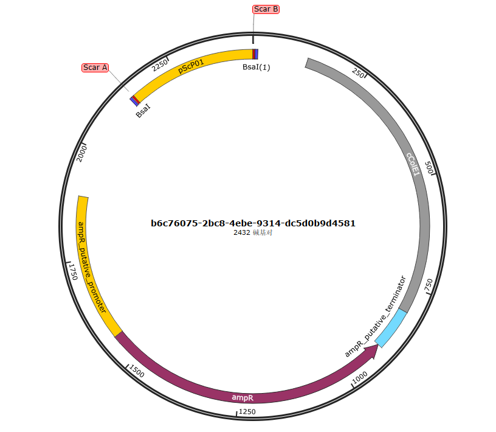
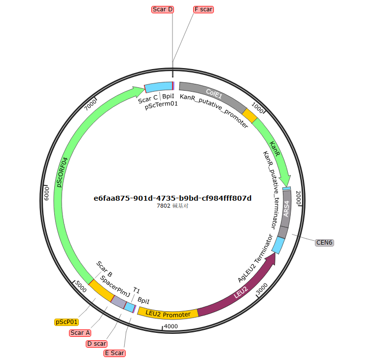
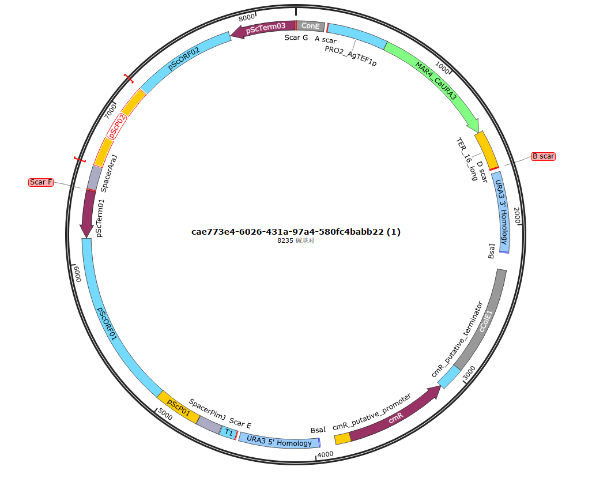

# 快速上手

## 三级组装快速上手指北

KitAssembly 按照 Level 1、Level 2、Level 3 的层级组织组装流程，适合从基础元件设计逐步推进到复杂线路整合。

## Level 1 基础组装

Level 1 主要用于单元件基础构建，是初次使用者最容易上手的部分。

1. 选择目标物种：在 `category` 中选择 `E. coli` 或 `S. cerevisiae`。
2. 选择元件与载体：匹配对应的 Level 1 元件和 Backbone。
3. 点击开始组装，等待系统完成组装计算并生成结果。
4. 当页面出现 `Assembly completed` 提示后，即可下载组装图谱与序列文件。

### Level 1 组装结果示例

下图展示了 Level 1 组装完成后的结果示例：

## Level 2 多元件组装

Level 2 主要用于功能模块构建，可在同一轮设计中组合多个功能元件，并匹配相应的 Level 2 载体。

该流程与 Level 1 类似，但适合更复杂的片段拼接任务，能够帮助参赛者快速构建表达模块或功能单元。

### Level 2 组装结果示例

下图展示了 Level 2 组装完成后的结果示例：

## Level 3 高阶组装

Level 3 适用于复杂通路或多模块整合设计。

1. 从历史记录中选择两个及以上已完成的 Level 2 质粒。
2. 选择对应的 Level 3 载体骨架。
3. 一键发起组装，并下载高阶组装结果。
4. 该模式特别适合复杂代谢通路、基因线路等高级项目设计场景。

### Level 3 组装结果示例

下图展示了 Level 3 组装完成后的结果示例：

