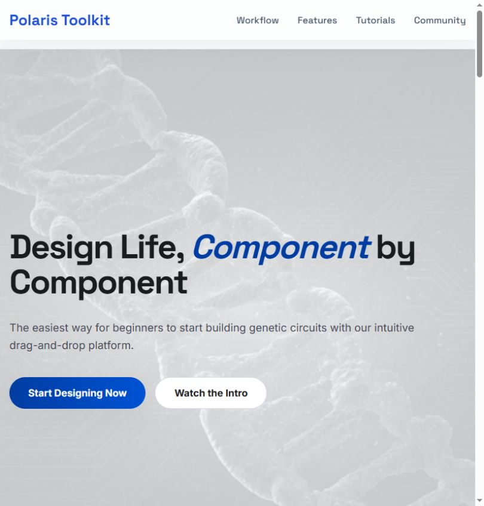
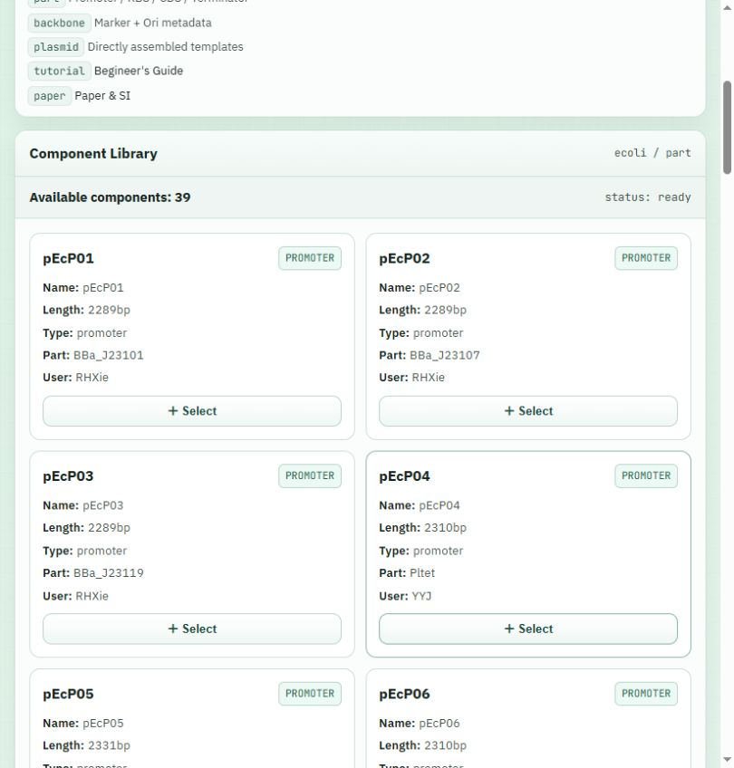
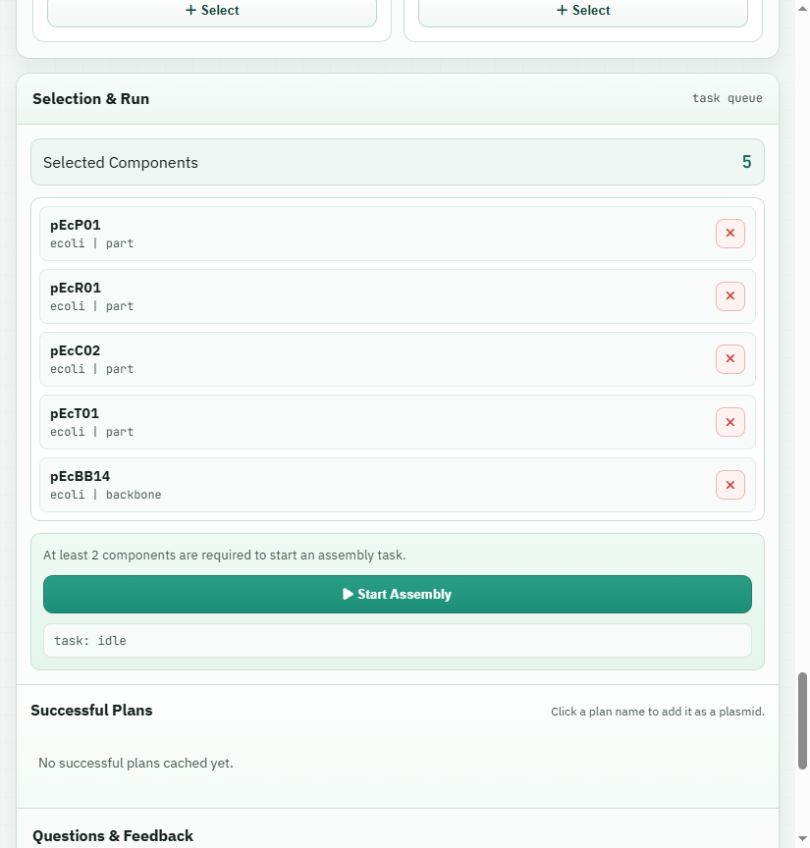
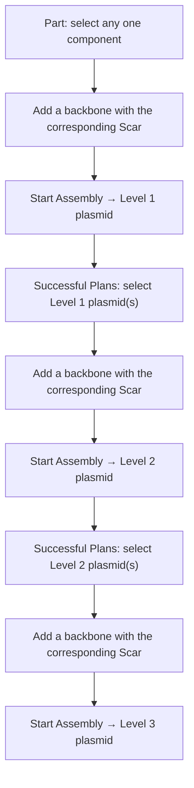

# Polaris Kit Assembly

*A gene circuit automated design platform based on a component database.*
 


---

## Overview

**Polaris Kit Assembly** is a comprehensive platform that enables synthetic biology researchers and beginners to design genetic circuits in a few clicks. It consists of two core Django sub‑projects:

- **WebDataBase** – provides database APIs and business‑logic APIs for the entire platform.
- **KitAssembly** – delivers a user‑friendly web service that allows beginners to select biological parts (components, vectors, plasmids) and automatically assemble them into complete gene circuits, returning a visual circuit map.

---

## Sub‑Projects

### WebDataBase
`WebDataBase` is a Django‑based backend service that:
- Manages the component database (parts, vectors, plasmids, and their metadata).
- Exposes RESTful APIs for querying, filtering, and retrieving component information.
- Implements core business logic (e.g., assembly rules, compatibility checks) used by the frontend and the KitAssembly service.

All API endpoints are versioned and documented for easy integration.

### KitAssembly
`KitAssembly` is the end‑user web application, also built with Django. It is designed for **synthetic biology beginners** who want to design gene circuits without prior programming or bioinformatics expertise.

#### Key features:
- **Part Selection** – Browse and select one or more genetic components (promoters, CDSs, terminators, etc.) from the database.
- **Vector & Plasmid Selection** – Choose a compatible vector backbone for your assembly.
- **One‑Click Assembly** – Once parts and a vector are selected, the backend validates compatibility and assembles the circuit.
- **Visual Output** – After successful assembly, the server returns a graphical gene circuit map (e.g., SVG or PNG) that clearly shows the final construct.

---

## Getting Started

### Prerequisites
- Python 3.10+
- pip
- PostgreSQL or SQLite (development)
- Git

### Installation

1. Clone the repository:
   ```bash
   git clone https://github.com/ChenYe-Lab/PolarisKitAssembly.git
   cd PolarisKitAssembly
   ```

2. Set up environment variables:
   - Copy the example environment file:
     ```bash
     cp .env.example .env
     ```
   - Edit `.env` and fill in your secrets and database credentials (see comments inside the file).

3. Install dependencies:
   ```bash
   pip install -r requirements.txt
   ```

4. Run database migrations for both projects:
   ```bash
   python manage.py migrate --settings=WebDataBase.settings
   python manage.py migrate --settings=KitAssembly.settings
   ```

5. (Optional) Load initial component data using the provided fixtures.

### Running the Servers

- **For WebDataBase** (API server):
  ```bash
  python manage.py runserver --settings=WebDataBase.settings 8001
  ```
- **For KitAssembly** (web interface):
  ```bash
  python manage.py runserver --settings=KitAssembly.settings 8000
  ```

> **Note**: The two projects can run independently, but KitAssembly relies on WebDataBase APIs. Ensure that WebDataBase is reachable (adjust `API_BASE_URL` in `.env` if needed).

---

## Configuration

All sensitive and environment‑specific settings are stored in the `.env` file. Please refer to `.env.example` for the full list of required variables, including:

- Database connection strings
- Secret keys
- API endpoints
- Debug mode flags

---

## Usage Example

The screenshots below show the local KitAssembly website. Open the address and port configured for your frontend (for example, `http://localhost:8001/`); the backend API may use a different port. Component availability depends on your database.

1. **Open the builder.** On the homepage, click **Start Designing Now** to open `/kitserver/index`. If **Visitor Registration** appears on your first visit, enter your institution, lab/group, and name, then choose **Save And Continue**. Use **EN** or **中文** to switch the interface language.

   

2. **Browse and select components.** Choose **E.coli** or **S. cerevisiae**, then switch between **Part**, **Backbone**, and **Plasmid**. Review each card's metadata and click **Select** to add it; selected cards display **Selected**.

   

3. **Review the assembly plan.** Check **Selection & Run** (below the library on narrow screens). Use the remove button beside an entry to correct the selection. Follow the Level 1–3 workflow below to choose the inputs for each round. The screenshot demonstrates the selection controls only; its five-item selection is not the Level 1 recipe or a validated assembly result.

   

4. **Submit and download.** With at least two components selected, click **Start Assembly** and watch the task status. When the task completes, dismiss the success message to let the browser download the GenBank (`.gb`) file. Successful plan names appear in **Successful Plans** and can be added as plasmids for a later assembly. If the task fails, review the reported error and revise the selection. Open the downloaded GenBank file in a compatible sequence viewer to inspect the plasmid map and annotations.

### Level 1–3 Assembly Workflow

Build each level from the successful results of the previous level. Before starting a new round, remove the previous inputs from **Selection & Run** so that only the intended parts/plasmids and backbone remain selected.



1. **Level 1 — one part + a matching backbone.** In **Part**, select any **one** component. Switch to **Backbone** and select the backbone with the corresponding **Scar** for that component. Review the two selected inputs and click **Start Assembly**. After a successful run, download the Level 1 GenBank file; its plan name is available in **Successful Plans**. Repeat this step for each Level 1 plasmid needed in the next round.

2. **Level 2 — Level 1 plasmids + a matching backbone.** In **Successful Plans**, click the required **Level 1** plan names to add those assembly results as plasmid inputs. In **Backbone**, select the backbone with the corresponding **Scar** for this assembly. Review the selected plasmids and backbone, then click **Start Assembly** to generate the Level 2 plasmid. The successful Level 2 result is also listed in **Successful Plans**.

3. **Level 3 — Level 2 plasmids + a matching backbone.** Follow the same procedure as Level 2, but select the **Level 2 assembly results** from **Successful Plans**. Add the backbone with the corresponding **Scar**, review the inputs, and click **Start Assembly** to generate and download the Level 3 plasmid.

Check the backbone card's **Scar (bbsi)** / **Scar (bsai)** information for the relevant assembly step. For assembly-level details and example plasmid maps, see the [assembly tutorial](KitAssembly/docs/kitassembly/quickstart.md).

---

## Technologies

- **Django** & **Django REST Framework** – Backend APIs and web UI.
- **PostgreSQL** – Primary database.
- **Celery** (optional) – For asynchronous assembly tasks.
- **BioPython** – For sequence manipulation and validation.
- **Matplotlib / DNAplotlib** – For generating circuit diagrams.

---

## Contributing

Contributions are welcome! Please open an issue or submit a pull request with your improvements. Make sure to follow the coding style and include appropriate tests.


---

## License

This project is licensed under the **GNU General Public License v3.0** – see the [LICENSE](LICENSE) file for details.

---

## Contact

For database-related inquiries, please contact [synbio.db@siat.ac.cn](mailto:synbio.db@siat.ac.cn).
